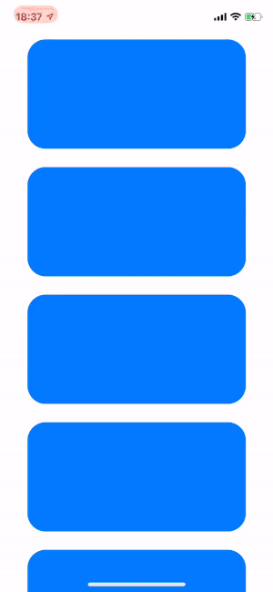

# iMessage bubble animation

Use a custom CollectionViewFlow layout to make the spring animation on the bubble in the iOS iMessage application. Based on videos of WWDC in 2013 : "Exploring Scroll Views on iOS 7"

Converted to Swift 5
